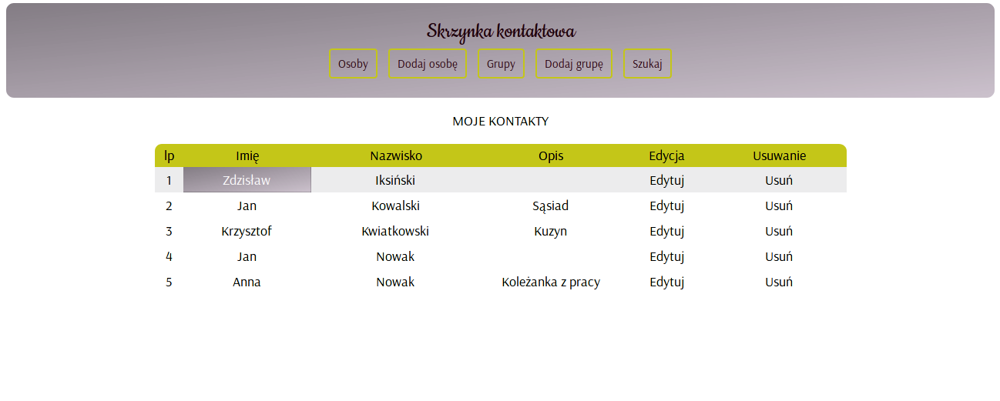

# Contact app

### Info
Simple app created for contacts management.

### Technologies
* Python 3.6 
* Django 2.1 
* PostgreSQL 10.6
* JavaScript

### Functions
* adding new person 
* adding and deleting phone number, address and e-mail to the existing contact
* creating groups
* adding person to group
* person search

### Installation
* create Postgres database 'contacts'
* clone and download repository
* install requirements
* run migrations for 'mail' app
